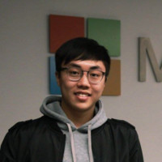

### Education:

* **The University of Hong Kong** (2016 - 2020)
    * Computer Science, Bachelor of Engineering (BEng)
    * Japanese Language, Minor in Department of Japanese Studies
* **Peking University** (2017)
    * Computer Science and Economy, Visiting Scholar

### Experience:

* **Student Partner**, Microsoft Hong Kong
* **FinTech Innovation Partner**, UBS Group AG
* **Analyst Programmer**, Introv Limited
* **Hong Kong Early Outreach Participant**, Credit Suisse
* **AIA innovation Partner**, AIA
* **Student Representative**, Department of Computer Science, The University of Hong Kong
* **Technical Trainee**, Infocan Compter (Hong Kong) Limited
* **Web Developer and Teaching Assistant**, HXCUP

### Volunteer Experience

* **Student Teaching Assistant**, The University of Hong Kong
* **Mentor**, Technovation Challenge

### Honors & Awards:

* **RISE Scholarship Awardee**, Launch Campus
* **UBS Champion Award**, UBS x RADICA x POLYU BigDatathon 2018
* **2018 Imagine Cup Hong Kong National Finalist**, Microsoft
* **2nd Runner-up, Classified Post Hackathon (InsurTech Category)**, AIA Group Limited, South China Morning Post
* **Elite 8 Teams, Microsoft Imagine Hack 2018**, Microsoft
* **Champion**, HKU CSA x ISA Open Hackathon 2017
* **Director's List 2016**
* **Dean List 2016**
* **HSBC Vocational Education Scholarship 2016**