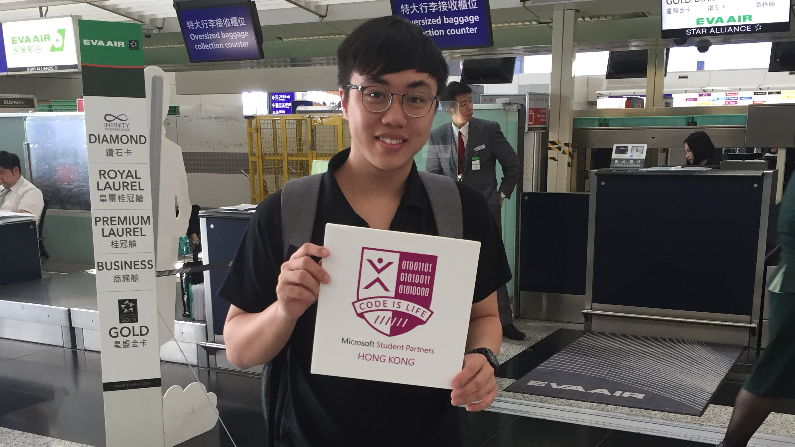
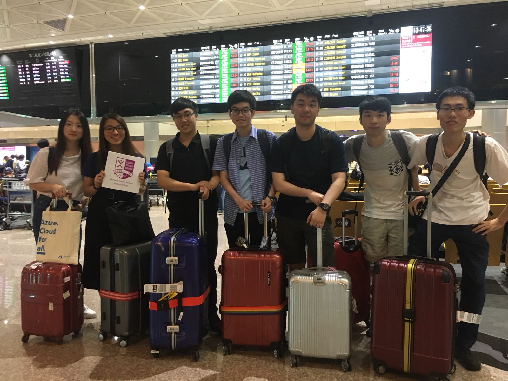
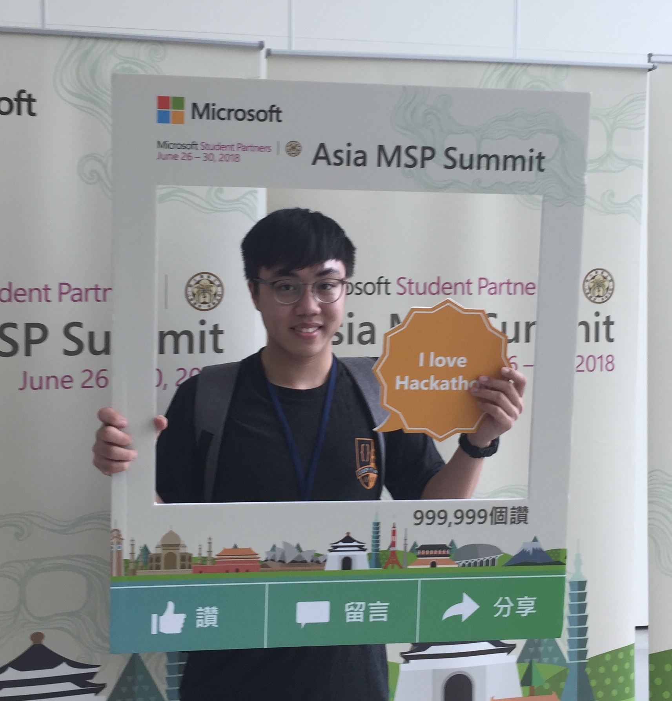

 

`Asia MSP Summit 2018` gathered 100 Microsoft Student Partners(MSP) from 12 countries. I was the one who had the chance luckily joining this amazing summit.

 

## What did I do

8 Hong Kong MSP are nominated to attend summit. 

I met Vietnam MSP

Thank you for everyone to be the Asia MSP Summit. And this is my pleasure to be selected as HKMSP representative to share HKMSP Highlight. I believe all MSPs would also admit that MSP is a challenging but rewarding program, so am I. 

## Feeling

It is an unforgetable experience for me, I have met many friends from different countries. We exchange our culture and experience. 

I hope I have opportunies to meet them again in the future.

> MSP is a journey, not a destinaion