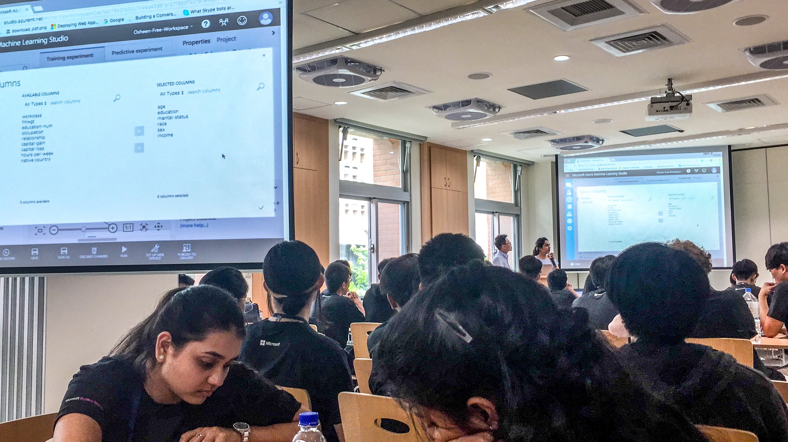

 

`Asia MSP Summit` gathered 100+ Microsoft Student Partners (MSP) from 12 countries. I was the lucky one who had the chance to join this amazing summit.

## 8 Hong Kong MSP

In Asia MSP Summit, 8 Hong Kong MSP are nominated to Taipei and brought some changes to our life.

## Ice-Breaker Night

Ice-breaker night was held on the first day night. I was sitting with MSP from 12 counties. Although we have different nationality, religion, and culture, we had a wonderful night. One thing I remember the most is that Vietnam MSP, Hung, and I talked about how Hong Kong culture influence Vietnam and how  Vietnam culture brings to Hong Kong. 

## MSP Highlight

It was my pleasure to be selected as HKMSP representative to have a speech in MSP Highlight. The topic was HKMSP achievements and experience through the year. Throughout my preparation and speech, I realized that I really learned so many things from Microsoft in the year.

## Key Note

## NLU Leadership sharing

## How will AI change our tomorrow

## Hour of AI Workshop & Hackathon

I did not expect that I could learn a new skill in the summit before. In second day I was surprised that I could try my hand at building my Machine Learning model in Hour of AI Workshop.

## Make New Friend

It is an unforgettable experience for me, I have made many friends from different countries. I really hope I have an opportunity to meet them again in the future.

They are my new friends, Hung from Vietnam and Steve from Malaysia. 

## What I have learned 

personality from other MSP, no sky, outgoing, not afraid of failure.

> MSP is a journey, not a destination

