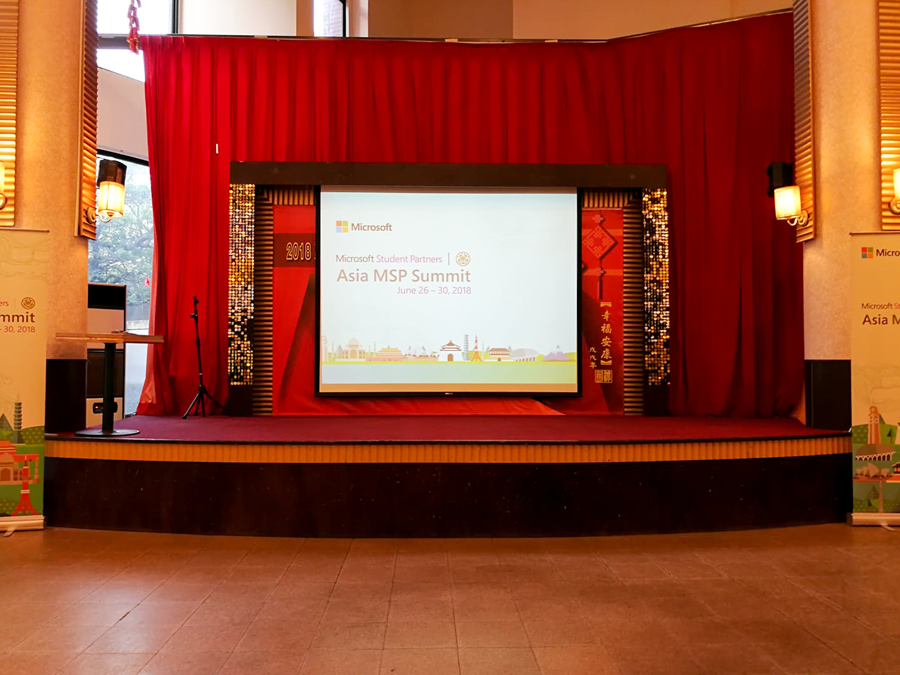
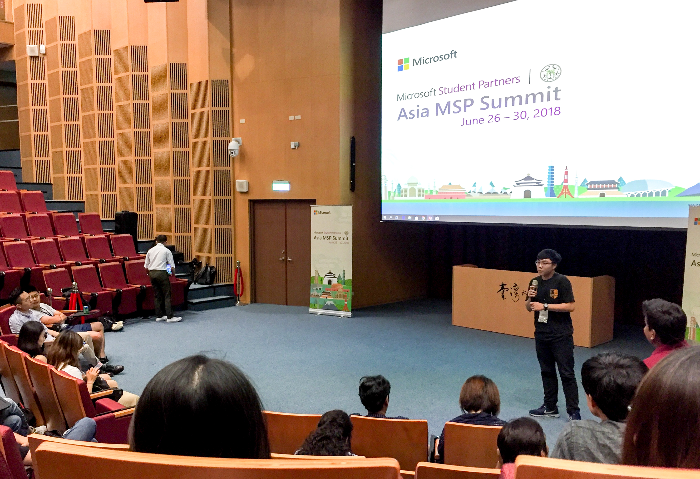
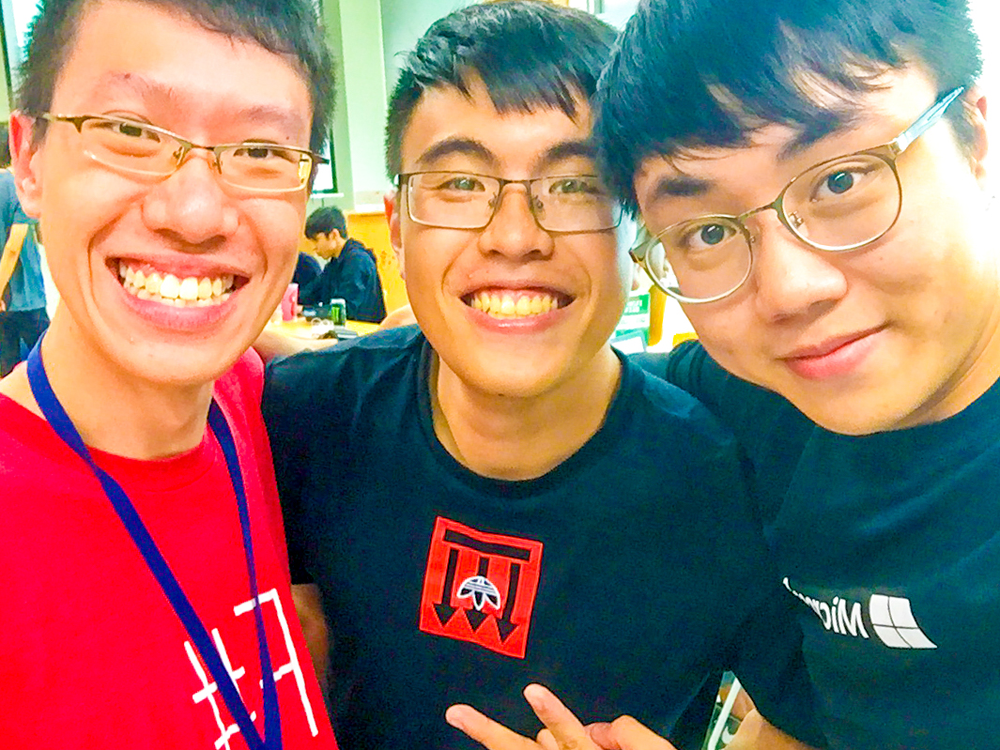

 

`Asia MSP Summit` gathered 100+ Microsoft Student Partners (MSP) from 15 countries. I was the lucky one who had the chance to join this amazing summit.

## 8 Hong Kong MSP

In Asia MSP Summit, 8 Hong Kong MSP were nominated to Taipei and brought some changes to our life.

## Ice-Breaker Night

Ice-breaker night was held on the first day night. I was sitting with other country MSP. Although we had different nationality, religion, and culture, we talked so happy in a wonderful night. One thing I remember the most was that Vietnam MSP, Hung, and I talked about how Hong Kong culture influences Vietnam and how Vietnam culture brings to Hong Kong. 

## MSP Highlight

It was my pleasure to be selected as HKMSP representative to have a speech in MSP Highlight. The topic was HKMSP achievements and experience through the year. Throughout my preparation and speech, I realized that I really learned so many things from Microsoft in this year.

## Hour of AI Workshop & Hackathon

I did not expect that I could learn new skill in the summit before. In second day I was surprised that I could try my hand at building my first Machine Learning model in Microsoft Machine Learning Studio during Hour of AI Workshop. Then in the third day, we have an exciting hackathon in the whole day. The challange was to contextualize customer data and predict the likelihood a user will stay at 100 different hotel groups for Expedia. 

## Make New Friend

It was an unforgettable experience for me, I have made many friends. I really hope I have an opportunity to meet them again.

Hung from Vietnam and Steve from Malaysia. 

## What I have learned 

From other MSP, I learned not only about their countries but also their personalities. How they are facing challenge, how they are presenting themselves and how they are being outgoing. These all things are what I have to learn from them after this summit.

##Thank you Microsoft and India MSP held this amazing Asia MSP Summit!

> MSP is a Journey, Not a Destination

