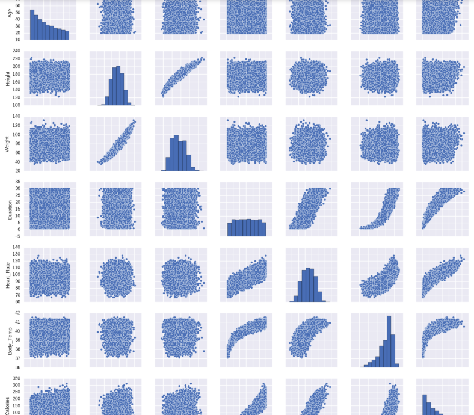
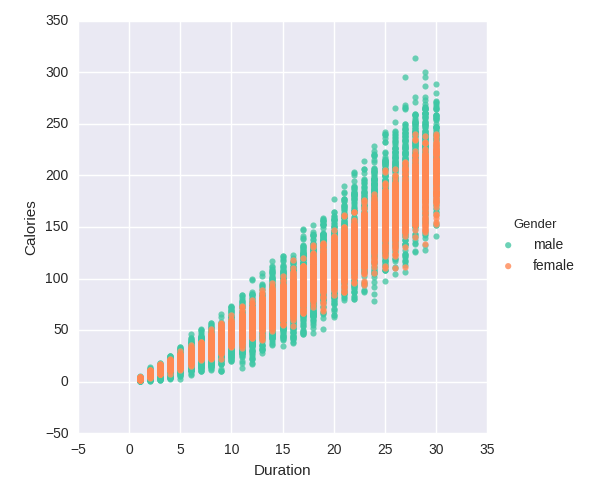

To find the relationship between two columns in dataset, [seaborn](https://seaborn.pydata.org/) can find it by using a scatter plot matrix.

```python
# Create a scatter plot matrix
%matplotlib inline
import seaborn as sns
num_cols = ["Age", "Height", "Weight", "Duration",
 "Heart_Rate", "Body_Temp", "Calories"]
sns.pairplot(frame[num_cols], size=2)
```



To show details in two specific data, e.g. Duration and Calories

```python
# Plot duration vs calories by gender
sns.lmplot(x = 'Duration', y = 'Calories', data = frame,
 hue = "Gender", palette = "Set2", fit_reg = False) 
```

