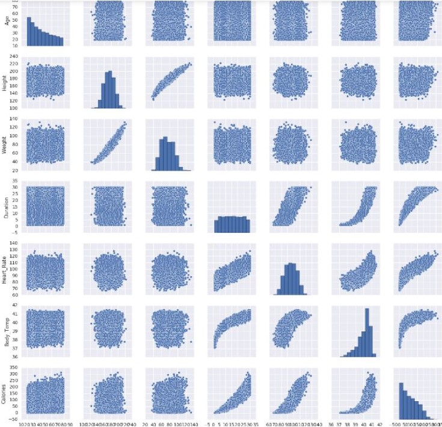

```python
# Create a scatter plot matrix
%matplotlib inline
import seaborn as sns
num_cols = ["Age", "Height", "Weight", "Duration",
 "Heart_Rate", "Body_Temp", "Calories"]
sns.pairplot(frame[num_cols], size=2)
```



https://courses.edx.org/courses/course-v1:Microsoft+DAT228x+2T2018/courseware/50bfda87c2a34d55a402a0ef642e45ad/4205b306efab4760a5073ec25bd13997/2?activate_block_id=block-v1%3AMicrosoft%2BDAT228x%2B2T2018%2Btype%40video%2Bblock%407e461e9924aa47bc839dd1eb459bc342