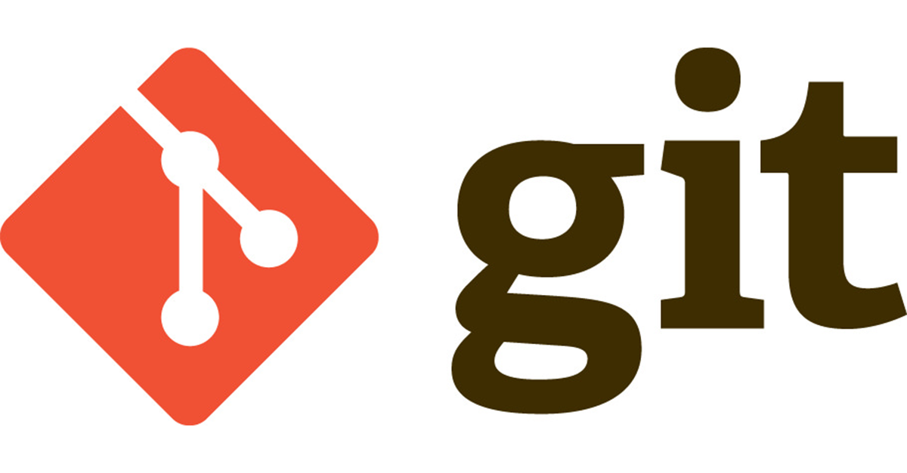

#Homebrew

Homebrew is a free and open-source software package management system that simplifies the installation of software on Apple's macOS operating system.

```bash
/usr/bin/ruby -e "$(curl -fsSL https://raw.githubusercontent.com/Homebrew/install/master/install)"
```

#nvm

Node Version Manager - Simple bash script to manage multiple active node.js versions

```shell
brew install nvm
nvm install node # install the latest release of node
nvm use node #use the installed version
```

#npm

npm is the package manager for JavaScript and the world’s largest software registry. Discover packages of reusable code — and assemble them in powerful new ways.

```shell
brew install npm
```

#Git

Git is a free and open source distributed version control system designed to handle everything from small to very large projects with speed and efficiency.

```shell
brew install git
```

#Reference
1. [Homebrew Official Website](https://brew.sh/)
2. [Homebrew - Wikipedia](https://en.wikipedia.org/wiki/Homebrew_(package_management_software))
3. [nvm github Repository](https://github.com/creationix/nvm)
3. [npm Official Website](https://www.npmjs.com/)
4. [Git Official Website](https://git-scm.com/)