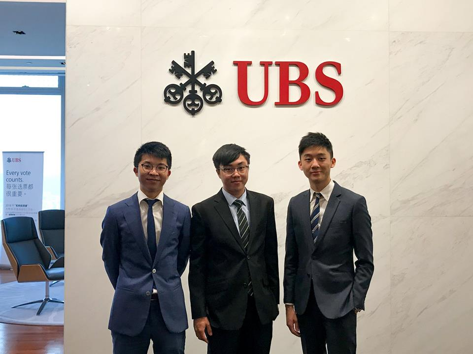
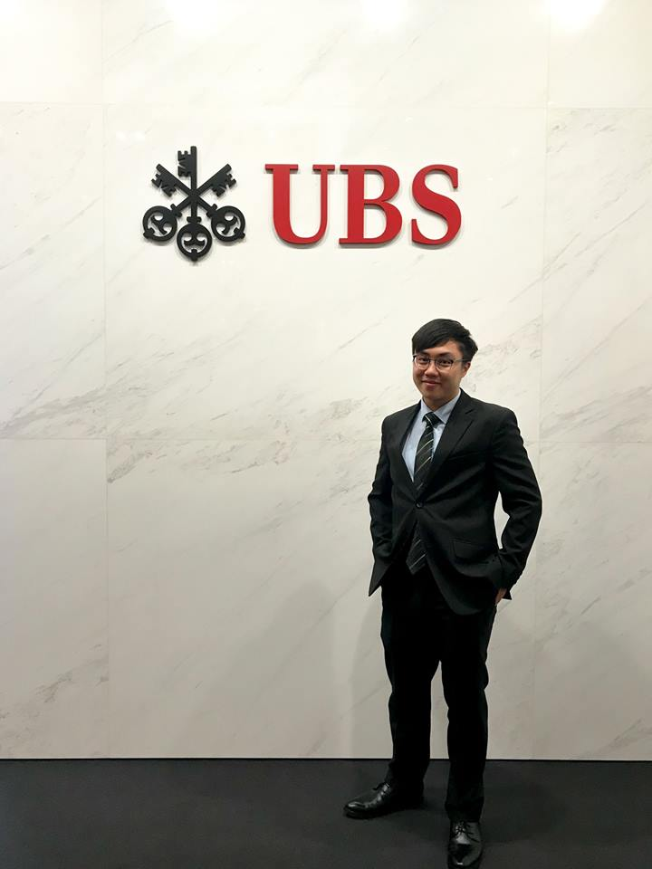
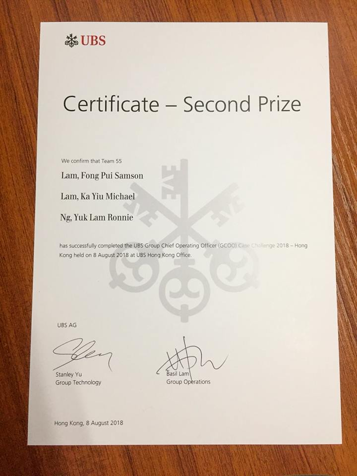

Today’s wealth management bottleneck ties with the identification of emerging mass affluent, the efficiency of account opening, the sensitivity towards regulatory changes, and the minimization of operational costs.

Being part of the competing team with Lam Ka Yiu and Ronnie Ng, we share a broader perspective that comes from a strong underlying passion to make UBS better, beyond our own project agenda, because what happens in this building is going to impact the rest of the market. With 3 strategic priorities complimented by 4 cutting-edge innovations, we are so blessed to witness the moment when our proposal was adopted by a vast majority of industry professionals.

A sincere thanks goes to my dearest big brother Charles Wong, who has been guiding me along the way, from business dressing, market intelligence to strategy execution…...your good deeds will always be remembered, and I will keep it up to surpass your streak.

