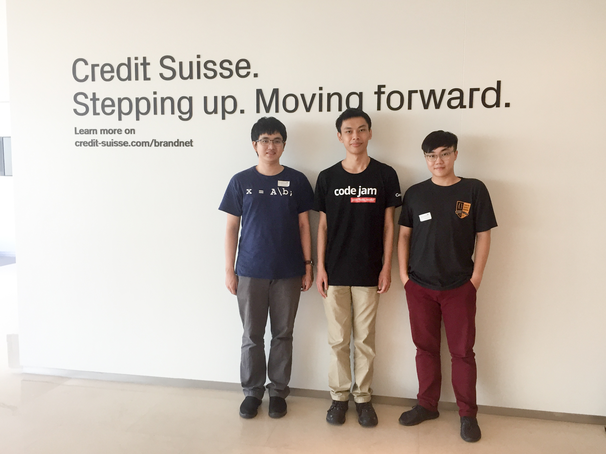
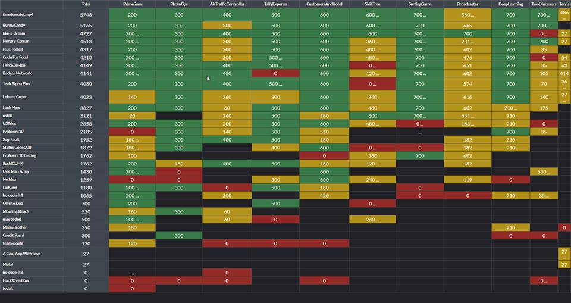
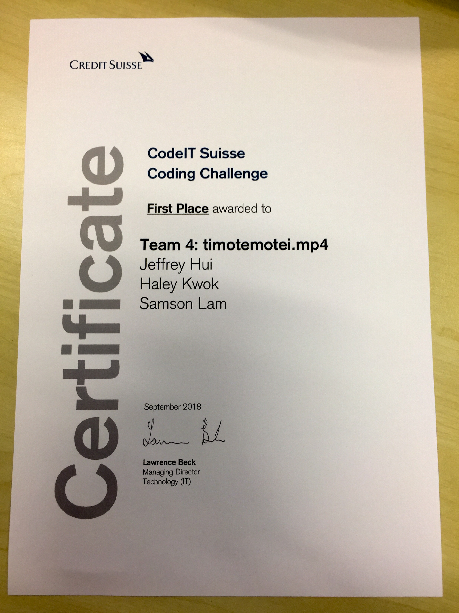

A humble victory to mark the end of an explosive Q3 in 2018! Hats off to Haley Kwok, Jeffrey Hui for making our dream come true at Credit Suisse. Cracking down 11 separated challenges non-stop for 27 hours, 2018 CodeIT Suisse is indeed a stress test to examine my takeaways from previous tournaments covering deep learning and web framework implementation, and our competitors scored really close since they were the sharpest blades that this generation has to offer.

Celebrating success and reflecting on losses reaffirms my enthusiasm for entrepreneurship & technology trends, and emotional intelligence is without a doubt the key to keeping me calm and motivated on the hunt.

My team and I look forward to unleashing our forces for the remaining Q4. Stay blessed everyone and hit me up if we have to pleasure to collaborate on forthcoming projects.

