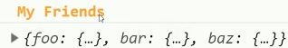
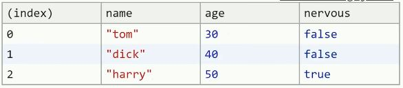
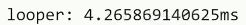
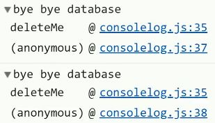

```javascript
// Computed Property Names

const foo = { name: 'tom',   age: 30, nervous: false };
const bar = { name: 'dick',  age: 40, nervous: false };
const baz = { name: 'harry', age: 50, nervous: true };

console.log('%c My Friends', 'color: orange; font-weight: bold;' )
console.log({ foo, bar, baz });
```



```javascript
// Table

console.table([foo, bar, baz])
```



```javascript
// Console.time

console.time('looper')

let i = 0;
while (i < 1000000) { i ++ }

console.timeEnd('looper')
```



```javascript
// Stack Trace Logs

const deleteMe = () => console.trace('bye bye database')

deleteMe()
deleteMe()
```



Source https://github.com/codediodeio/code-this-not-that-js