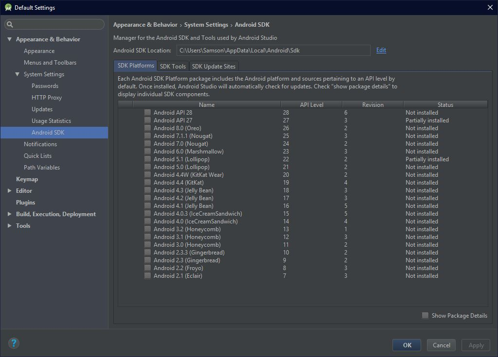

Find the Android SDK Location from SDK Manager in Android Studio.



Show The list of emulator device which have been already created
```bash
cd <Android SDK Location>\emulator
emulator -list-avds
```
Output
```bash
Nexus_5X_API_28
```
Run the emulator with its name
```bash
emulator @Nexus_5X_API_28
```
