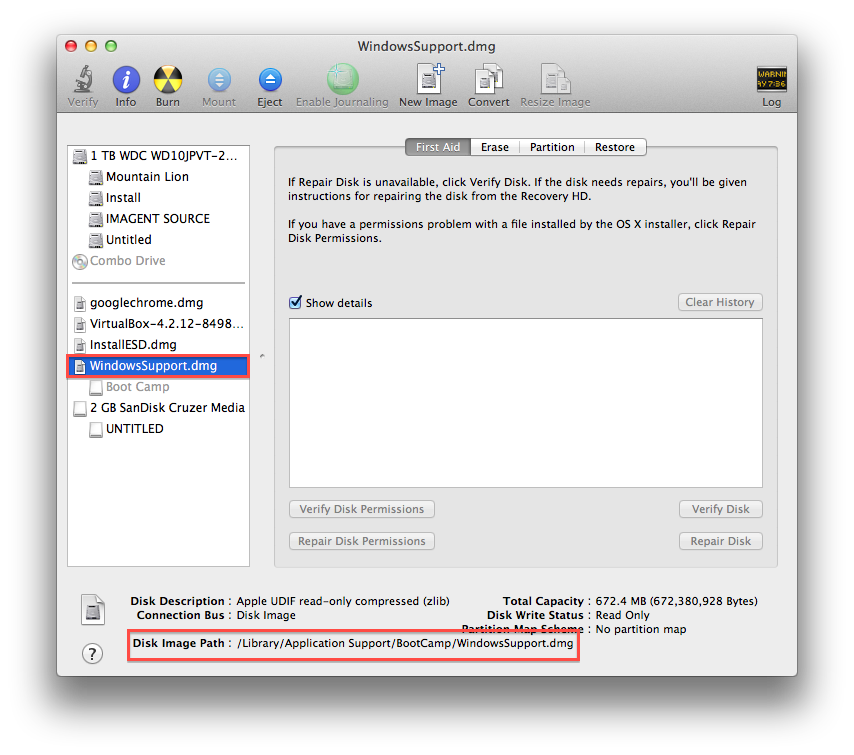
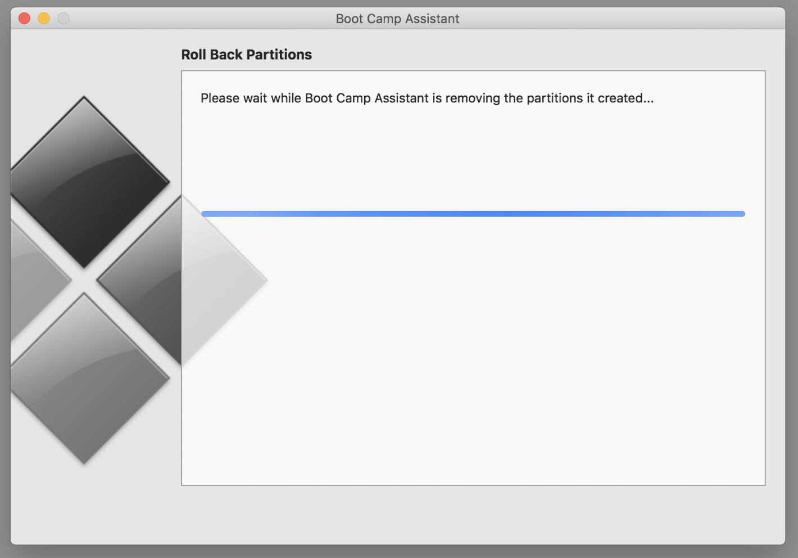

If you are installing Windows in your MacBook using Boot Camp. After downloading Windows Support Software, "The Windows Support Software Could Not Be Saved To The Selected Drive folder" error occurs.



Then you go to roll back partitions but stuck on "please wait while boot camp assistant is removing the partitions it created".



First thing you have to do is checking the information on all available disks and their partitioning by run this command.
```shell
diskutil list
```

You will look some output like this.
```shell
/dev/disk0 (internal, physical):
   #:                       TYPE NAME                    SIZE       IDENTIFIER
   0:      GUID_partition_scheme                        *251.0 GB   disk0
   1:                        EFI EFI                     209.7 MB   disk0s1
   2:                 Apple_APFS Container disk1         192.0 GB   disk0s2
   3:       Microsoft Basic Data OSXRESERVED             8.0 GB     disk0s3
   4:       Microsoft Basic Data BOOTCAMP                50.8 GB    disk0s4

/dev/disk1 (synthesized):
   #:                       TYPE NAME                    SIZE       IDENTIFIER
   0:      APFS Container Scheme -                      +192.0 GB   disk1
                                 Physical Store disk0s2
   1:                APFS Volume Macintosh HD            100.4 GB   disk1s1
   2:                APFS Volume Preboot                 22.7 MB    disk1s2
   3:                APFS Volume Recovery                518.1 MB   disk1s3
   4:                APFS Volume VM                      2.1 GB     disk1s4

/dev/disk2 (disk image):
   #:                       TYPE NAME                    SIZE       IDENTIFIER
   0:                            CCCOMA_X64FRE_EN-US... +4.7 GB     disk2
```

Run this command to merge OSXRESERVED and BOOTCAMP.

```shell
diskutil eraseVolume jhfs+ BC1 disk0s3

diskutil eraseVolume jhfs+ BC2 disk0s4

diskutil mergePartitions jhfs+ BCMP disk0s3 disk0s4

diskutil eraseVolume fat32 BOOTCAMP disk0s3
```

Check disk information again, the output would be

```shell
/dev/disk0 (internal, physical):
   #:                       TYPE NAME                    SIZE       IDENTIFIER
   0:      GUID_partition_scheme                        *251.0 GB   disk0
   1:                        EFI EFI                     209.7 MB   disk0s1
   2:                 Apple_APFS Container disk1         192.0 GB   disk0s2
   3:       Microsoft Basic Data BOOTCAMP                58.7 GB    disk0s3

/dev/disk1 (synthesized):
   #:                       TYPE NAME                    SIZE       IDENTIFIER
   0:      APFS Container Scheme -                      +192.0 GB   disk1
                                 Physical Store disk0s2
   1:                APFS Volume Macintosh HD            100.3 GB   disk1s1
   2:                APFS Volume Preboot                 22.7 MB    disk1s2
   3:                APFS Volume Recovery                518.1 MB   disk1s3
   4:                APFS Volume VM                      2.1 GB     disk1s4

/dev/disk2 (disk image):
   #:                       TYPE NAME                    SIZE       IDENTIFIER
   0:                            CCCOMA_X64FRE_EN-US... +4.7 GB     disk2
```

Run Boot Camp again and click Restore.
Congratulations!! The partitions are Removed successfully.

```shell
/dev/disk0 (internal, physical):
   #:                       TYPE NAME                    SIZE       IDENTIFIER
   0:      GUID_partition_scheme                        *251.0 GB   disk0
   1:                        EFI EFI                     209.7 MB   disk0s1
   2:                 Apple_APFS Container disk1         250.8 GB   disk0s2

/dev/disk1 (synthesized):
   #:                       TYPE NAME                    SIZE       IDENTIFIER
   0:      APFS Container Scheme -                      +250.8 GB   disk1
                                 Physical Store disk0s2
   1:                APFS Volume Macintosh HD            100.3 GB   disk1s1
   2:                APFS Volume Preboot                 22.7 MB    disk1s2
   3:                APFS Volume Recovery                518.1 MB   disk1s3
   4:                APFS Volume VM                      2.1 GB     disk1s4

/dev/disk2 (disk image):
   #:                       TYPE NAME                    SIZE       IDENTIFIER
   0:                            CCCOMA_X64FRE_EN-US... +4.7 GB     disk2
```

#Reference
1. [Stuck on "please wait while boot camp ass… - Apple Community](https://discussions.apple.com/thread/8140387)
2. [Command Line Mac: Using diskutil](http://commandlinemac.blogspot.com/2008/12/using-diskutil.html)