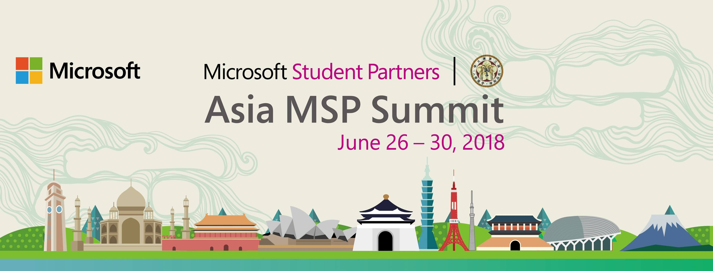
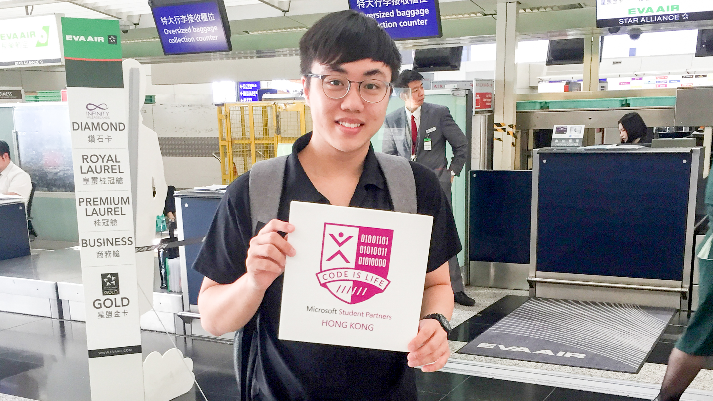
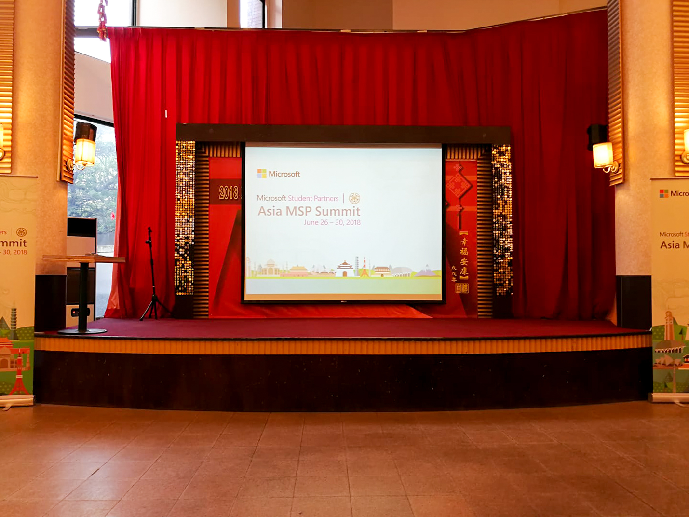
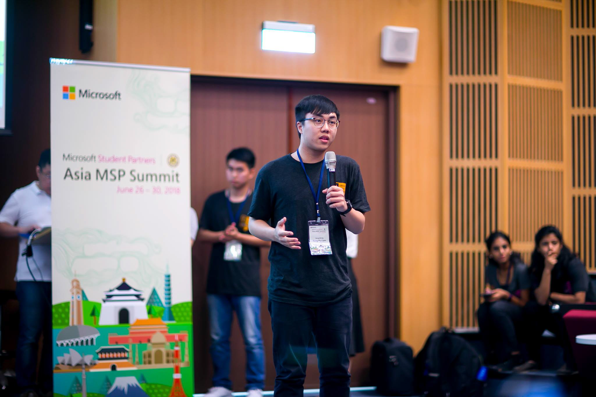
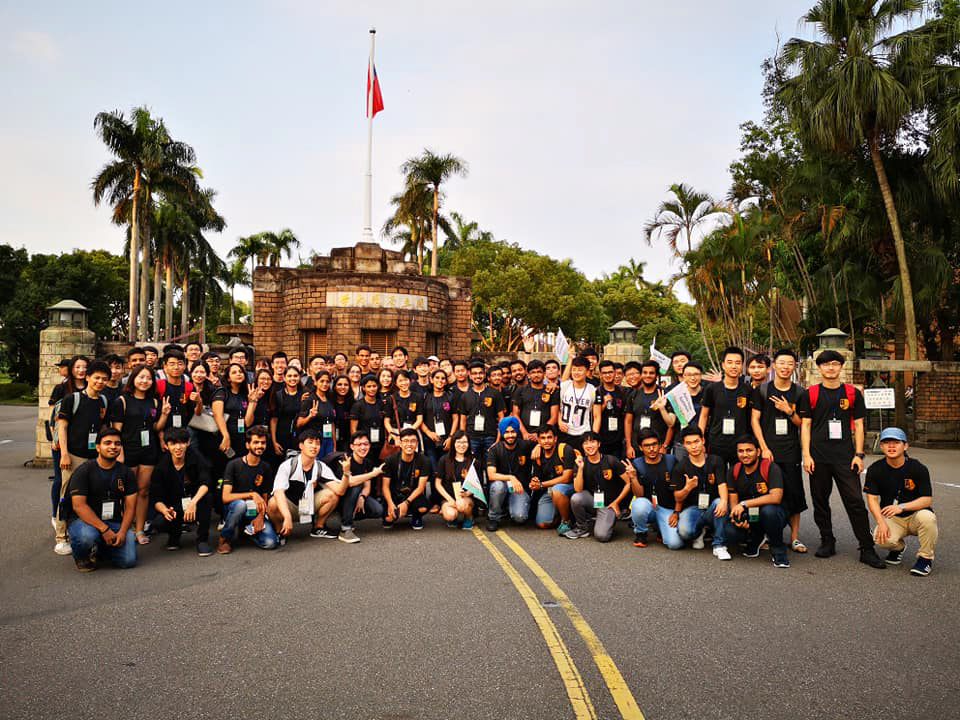

 

June 26-30, 2018 are the remarkable dates to all `Microsoft Student Partners` (MSP) from around the globe, as 100+ exceptional partners from 15 countries were cordially invited for the yearly summit in Taipei. Being one of the 8 Hong Kong representatives, I felt like the weight of the entire regional batch had been lifted from my shoulders, ever since I was delegated a speech on how HKMSP accelerated my technology career and transferred my view on the contemporary FinTech landscape.

## Ice-Breaker Night

Ice-breaker night was held on the first day night. All MSP had dinner together. Although we had different nationality, religion, and culture, we had a wonderful night. 

## MSP Highlight

It was my pleasure to have a speech in MSP Highligh. Throughout my preparation and speech, I found that HKMSP gave me so many things in this year.

## Hour of AI Workshop & Hackathon

I did not expect that I could learn a new skill in the summit before. In second day I was surprised that I could try my hand at building my first Machine Learning model in Microsoft Machine Learning Studio during Hour of AI Workshop. In the third day, we have an exciting hackathon in the whole day.

## Make New Friend

It was an unforgettable experience. I have made many friends and really hope that we can meet again.

Hung from Vietnam and Steve from Malaysia. 

## What I have learned 

No one is born ready for the forthcoming technology transformation, even for the gifted. Listening to story of other international MSPs reaffirmed my aspiration on computer engineering, and I am more determined to pursue my career as a change agent, shaping the new way of enterprise thinking through technology deployment. 

MSP maybe a springboard for having a glimpse of internet industry, but to me, its different. These three characters symbolize a year of dedication, growth and nurturing, and I am truly grateful for having countless blessings from Microsoft. 

##Thank you Microsoft and India MSP held this amazing Asia MSP Summit!

> MSP is a Journey, Not a Destination

